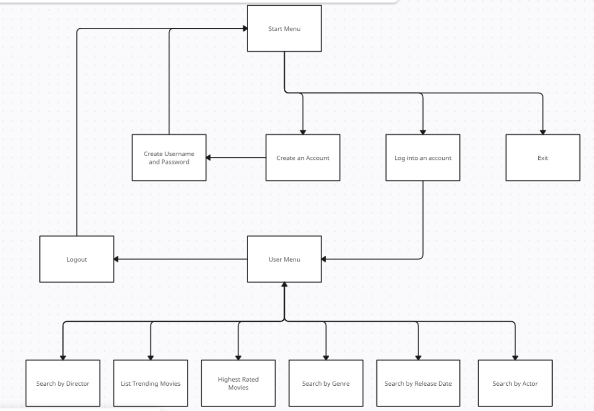
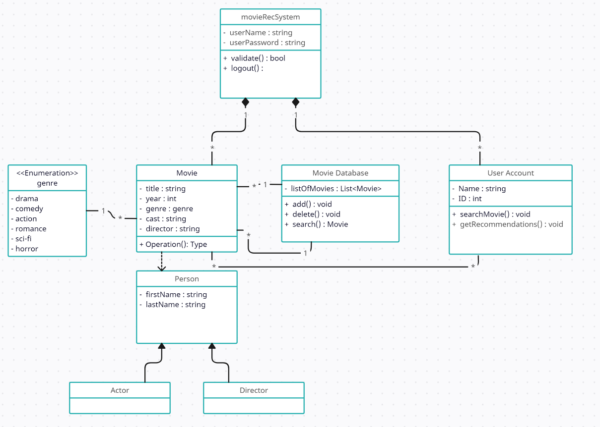
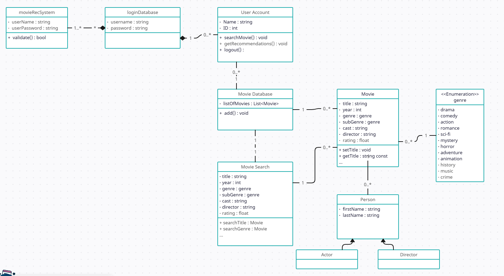
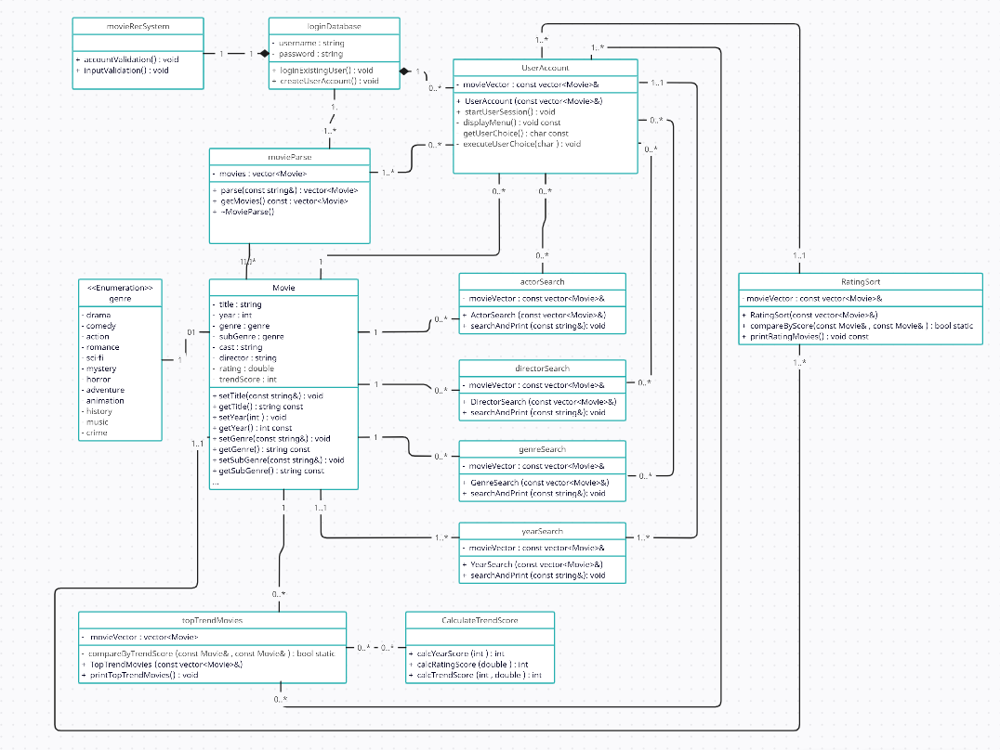

# Movie Recommender
 
 Authors: [Thomas Nguyen](https://github.com/Xekuu) [Randy Pham](https://github.com/randypham037) [Alex Back](https://github.com/Abackq) [Tayvin Nguyen](https://github.com/TayvinN)

## Project Description

 * This is important to people that are struggling with deciding on a particular movie and don't know where start.
 * Languages and tool we will be using is C++, Visual Studio Code
 * The inputs of our project from the user will be along the lines of movie genres, movie ratings, age of user, profiles, etc. Outputs will be a list of recommended movies according to the user's interests.
 * The features that this project provides is giving users the option to search for movies via different filters or they can view the top trending movies that the system recommends. This project will have a catalog of movies that can be narrowed down using multiple different filters such as the genre, release date of the movie, ratings, actors, directors. Movies can also be sorted according to the filters.

## User Interface Specification

### Navigation Diagram

### Screen Layouts
The login menu will ask the user for their username first then password. Once they have logged in they will be directed to the Catalog of Movies where we can see the latest movies that were released. The Catalog acts more like a menu than actually recommending movies, as such we can get to the logout, search bar, filter, and recommended movies. The logout option will logout the user and take them back to the login screen. The search bar will just allow the user to type into the terminal and search for movies directly. The Filter Movies option will ask the user to choose to filter by rating, directors, genres, quality, and trending. The recommended movies option will recommend movies to the user if they have preferred options, if not then it will automatically recommend trending movies. The user will be able to select a movie to see a longer description of that movie according to all the available filters.

## Class Diagram

For this system, we are implementing a simple authentication/login menu along with multiple avenues of searching/finding movies recommended by the system; some of these include search by director, similar genre, and actor. In order to develop this system, the diagram depicted here is necessary in order to visualize the required classes of our system. Derived classes of actor(s) and director(s) need to be included for us to be able to search the list for these objects. The movies object would need to hold the title, release year (this is another one of our search filters), genre, cast and director; these attributes are held within the class. An efficient data structure would need to be used to hold the database of movies -- the list is put there temporarily. If we are to use an open-source database for our movie list, searching would take any possibility of time, so implementation of an efficient searching algorithm would be necessary.

This updated UML diagram applies the points that were mentioned during our TA scrum meeting as well as implements the Single-Responsibility principle of the SOLID principles. In order to apply the solid principle, two classes were added: the loginDatabase as well as the Movie Search class. Before, the user account was responsible for validating the user account information from the starting interface, or movieRecSystem class; with the inclusion of the loginDatabase, the new class facilitates the login validation from the starting interface and then sends the user to their account. The Movie Search class aims to do something similar by relieving the Movie Database class from having to perform specific search operations on the database. The Single-Responsibility principle aims to isolate changes on the system and reduce the impact bugs if they were to occur.

 
## Screenshots
Screenshots of the input/output after running your application

## Installation/Usage
Instructions on installing and running your application
There are no installations needed to run our application. To run, build with cmake . and make, then run the executable ./movieRecTest. The program will continue to run and capture user input until the user is logged out and chooses to exit the program. User has the option to create a new account or log into an existing one. Once logged in, the user can choose to list the current trending movies, and search by release date, director, actor, or genre. There is also an option to view the top rated movies in the database as well as logout. The first option will list the ten movies in the database with the highest trending score that has been calculated based on release date and rating. The following search choices will all print 3 randomly chosen movies from the database that fit the search. Searching by release date will prompt the user for a desired decade between 1920 and 2020 and will output 3 movies from that decade. Search by director and by actor will prompt for them respectively and output the same way. Search by genre will prompt the user to choose from 12 different possible genres and output three movies with that genre as their genre or subgenre. Choosing to view the top rated movies will output the top 10 highest rate movies in the database, and logout is straightforward. Once logged out the user has the same 3 options as in the beginning.

## Testing
In our project we used google test framework along with CMake to create unit tests and check if our functions and methods are performing what we expect. We created unit tests for actorSearch and directorSearch methods for empty cases and also to check if there is a valid actor or director within our movie list. We also created unit tests for our movie object class to check if the getters and setters of our movie object class is doing what we expect.
 
